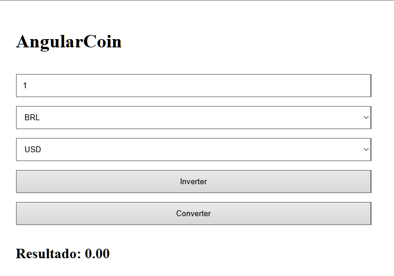
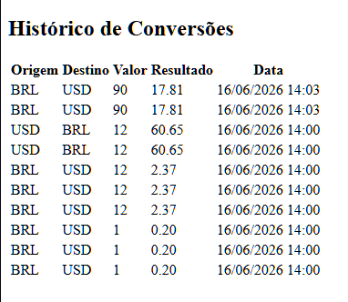
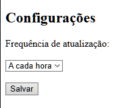
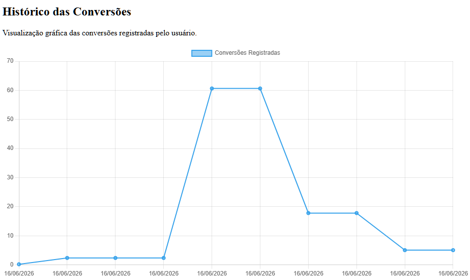

# 💰 AngularCoin

Aplicação web desenvolvida em Angular para conversão de moedas em tempo real utilizando consumo de APIs REST.

## 📋 Informações do Projeto

**Aluno:** Samuel Feliciano da Silva

**Matrícula:** 01792472

**Disciplina:** Desenvolvimento Web

## 🎯 Objetivo

Desenvolver uma aplicação capaz de consultar taxas de câmbio atualizadas em tempo real e realizar conversões entre diferentes moedas internacionais, utilizando APIs REST externas e recursos de armazenamento local.

## 🚀 Funcionalidades

* Conversão de moedas em tempo real
* Consumo de API REST de câmbio
* Suporte a múltiplas moedas internacionais
* Conversão inversa entre moedas
* Histórico de conversões
* Armazenamento local com Local Storage
* Funcionamento offline utilizando a última cotação salva
* Configurações de atualização
* Interface responsiva
* Navegação entre páginas

## 🛠️ Tecnologias Utilizadas

* Angular 21
* TypeScript
* HTML5
* CSS3
* Angular Router
* HttpClient
* Local Storage
* Exchange Rate API

## 📦 Instalação

Clone o repositório:

```bash
git clone https://github.com/samysamuelfeliciano-lab/AngularCoin.git
```

Acesse a pasta:

```bash
cd AngularCoin
```

Instale as dependências:

```bash
npm install
```

Execute o projeto:

```bash
ng serve
```

Acesse:

```text
http://localhost:4200
```

## 📷 Screenshots

### Conversor de Moedas



### Histórico das Conversões



### Configurações



### Gráfico das Conversões



## 🌐 API Utilizada

O projeto utiliza uma API pública de câmbio para consulta de taxas atualizadas em tempo real.

Endpoint base:

```text
https://open.er-api.com/v6/latest/
```

## 💾 Armazenamento Local

A aplicação utiliza Local Storage para:

* Salvar histórico de conversões
* Armazenar taxas de câmbio
* Manter configurações do usuário
* Permitir funcionamento offline

## 📄 Licença

Este projeto está licenciado sob a licença MIT.
